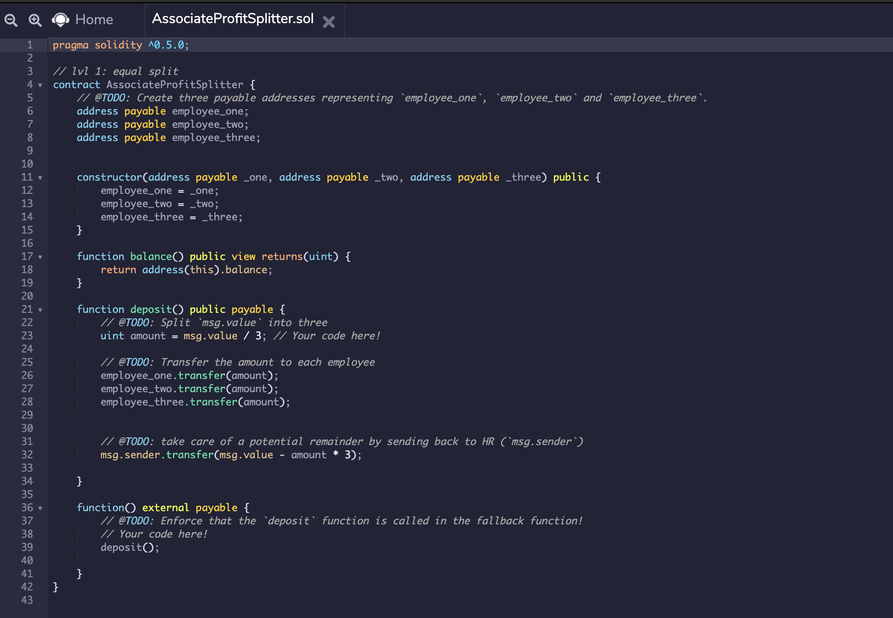
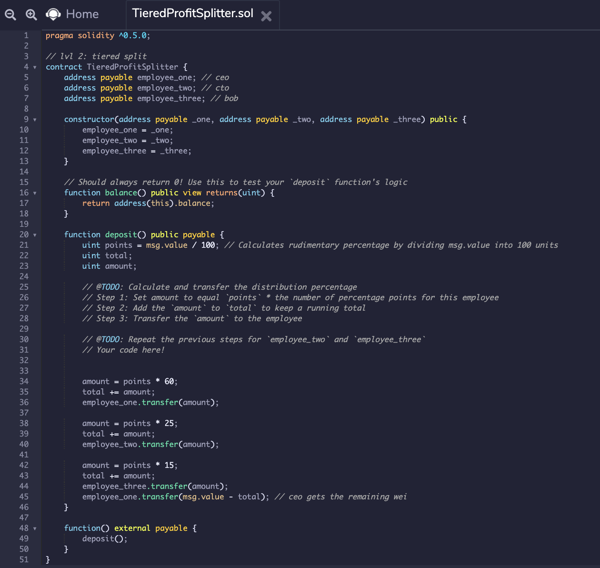
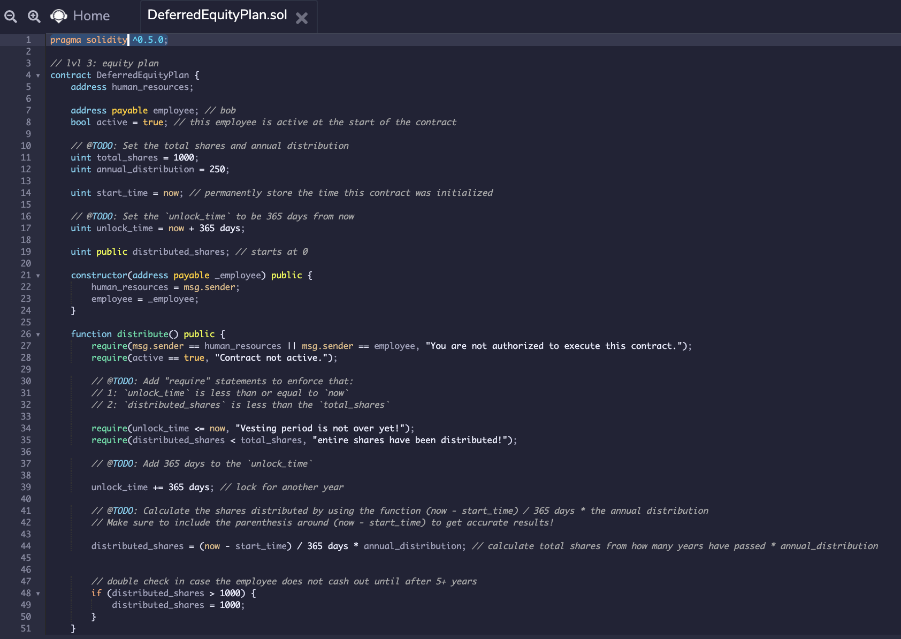
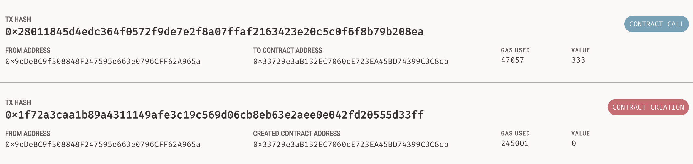
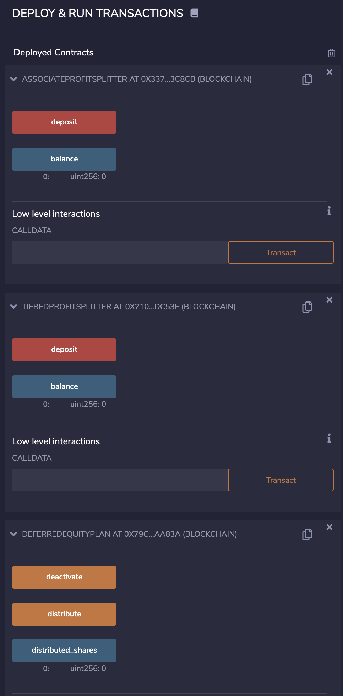

# solidity_eth

## Background
My new startup has created its own Ethereum-compatible blockchain to help connect financial institutions, and the team wants to build smart contracts to automate some company finances to make everyone's lives easier, increase transparency, and to make accounting and auditing practically automatic!
Fortunately, I know how to program smart contracts with Solidity! What I will be doing this assignment is creating a few ProfitSplitter contracts. These contracts will do several things:

* Pay your Associate-level employees quickly and easily.
* Distribute profits to different tiers of employees.
* Distribute company shares for employees in a "deferred equity incentive plan" automatically.

## Files

* AssociateProfitSplitter.sol
This will accept Ether into the contract and divide the Ether evenly among the associate level employees. This will allow the Human Resources department to pay employees quickly and efficiently.

* TieredProfitSplitter.sol 
This will distribute different percentages of incoming Ether to employees at different tiers/levels. For example, the CEO gets paid 60%, CTO 25%, and Bob gets 15%.

* DeferredEquityPlan.sol 
This models traditional company stock plans. This contract will automatically manage 1000 shares with an annual distribution of 250 over 4 years for a single employee.

Open these files at REMIX, Compile and Deploy them.

* Screenshot

After depolying Associate Profit Splitter
![deployed1] (screenshot/stage1deployed.png)

After deploying all 3 solidity codes

